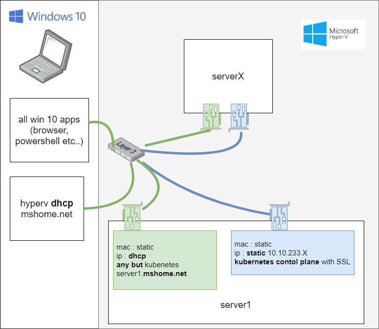

# What ? 

Winspray is set of functions made to ease Kubernetes multi-node and multi OS deployement on Hyperv via Vagrant and Kubespray. 

Goal : 
 - run kubespray with no effort on HyperV
 - easy & dynamic config

So far, known working vagrant boxes are "generic/centos8", "generic/debian10"  and "generic/ubuntu1910"

# Requirements

## Windows 10 software Requirements 

Latest [Vagrant](https://www.vagrantup.com/downloads.html) must be installed.

Latest [Docker Destkop](https://hub.docker.com/editions/community/docker-ce-desktop-windows) must be installed.

## Windows 10 network requirements

Ensure you're not connected into any kind of VPN or you'll probably get into troubles.

# Quick start

## Import module

Import from [Powershell Gallery](https://www.powershellgallery.com/packages/winspray/) : 

```powershell
Install-Module -Name winspray
```

## Create your cluster

Choose your infra : [pick one config file](https://github.com/jseguillon/winspray/tree/master/samples) on winspray github repo. You can edit and create your own. 

Create your cluster with `New-Winspray-Cluster` command. In this example, "minimal.yaml" infra is used : 

```powershell
New-Winspray-Cluster .\minimal.yaml
```

First installation may take as long as one hour, depending on your Internet connexion. Next install usually takes from a quarter to 25 minutes. 

# More usefulls commands 

### Restore 

```powershell
Restore-Winspray-Cluster # Restore all VMs to snapshot created right after installation is OK
```

### Quick Stop and start 

```powershell
Stop-Winspray-Cluster
Start-Winspray-Cluster
```

### Create a new cluster

```powershell
Remove-Winspray-Cluster
New-Winspray-Cluster .\mynewcluster.yaml

# or New-Winspray-Cluster minimal -Force 
```

### Other usefull commands 

```powershell
Get-Help winspray
```

# A bit of architecture 

## Network 

Since kubespray signs SSL certificates with IPs, and Hyperv defaults VMs with dynamic IPs and MACs, Winspray adds a secondary inteface, dedicated to kubernetes control-plane, with *static* IPs. 




## Main flow chart

This chart exposes behaviour of `New-Winspray-Cluster` with sub functions calls. 

```                                                                                                                                                                    
                                                                    winspray                                                                                         
            New-Winspray-Cluster             Vagrant             docker container              HyperV                  VMS
               |                                |                        |                       |                      | 
  Test-     |  |---------|                      |                        |                       |                      | 
  Winspray- |  |         | check env            |                        |                       |                      | 
  Env       |  |----------                      |                        |                       |                      | 
               |                                |                        |                       |                      | 
               |                    run playbook "create"                |                       |                      | 
  New-      |  --------------------------------------------------------->|                       |                      | 
  Winspray- |  |                                |                        |                       |                      | 
  Inventory |  |                 Vagrantfile and kubespray inventory     |                       |                      | 
               |<--------------------------------------------------------|                       |                      | 
               |                                |                        |                       |                      | 
               |        launch vagrant up       |                        |                       |                      | 
               |------------------------------->|     create VMs with additional interface       |                      | 
               |                                |----------------------------------------------->|                      | 
               |                                |                        |                       |     VMs are          | 
               |                                |                VMs created ok                  |    now created       | 
               |                                |<-----------------------------------------------|                      | 
               |           ok good to go        |                        |                       |                      | 
               |<------------------------------ |                        |                       |                      | 
               |                                |                        |                       |                      | 
               |                    run playbook "prepare"               |                       |                      | 
            |  |-------------------------------------------------------->|                       |                      | 
            |  |                                |                        |               prepare netwok                 | 
  Prepare-  |  |                                |                        |--------------------------------------------->| 
  Winspray- |  |                                |                        |                       |                      | 
  Cluster   |  |                                |                        |                  network ok                  | 
            |  |                           good to go                    |<---------------------------------------------| 
            |  |<--------------------------------------------------------|                       |                      | 
               |                                |                        |                       |                      | 
               |                launch kubespray "cluster" playbook      |                       |                      | 
            |  |-------------------------------------------------------->|                       |                      | 
            |  |                                |                        |             do all the kubespray magic       | 
  Install-  |  |                                |                        |--------------------------------------------->| 
  Winspray- |  |                                |                        |                       |                      | 
  Cluster   |  |                                |                        |          kubespray install done              | 
            |  |     THE END                    |                        |<---------------------------------------------| 
            |  |<--------------------------------------------------------|                       |                      | 
               |                                |                        |                       |                      | 
```

Note : hyperv snapshots are taken at the end of `Prepare-Winspray-Cluster` function and another one after `Install-Winspray-Cluster`. 

## Directories after creation 

```
yourpath:.
├───.vagrant # <- internal vagrant files
├───current
│   ├───config # <- kubespray config copied from winspray docker image. Overrides default `group_vars`
│   ├───credentials # <- kubespray gathered credentials
│   └───group_vars # <- default group_vars copied from kubespray defaults
├───kubespray_cache # <- downloaded binaries and docker images for kubespray. Kept for faster re-install.
```
